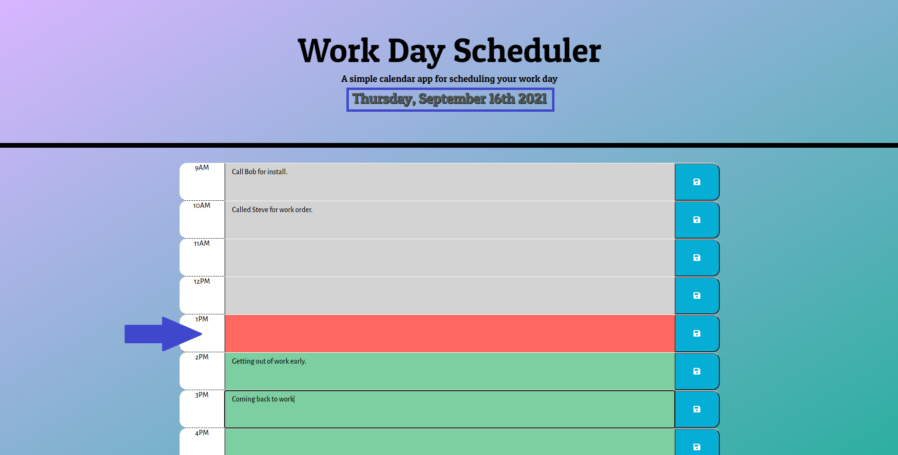
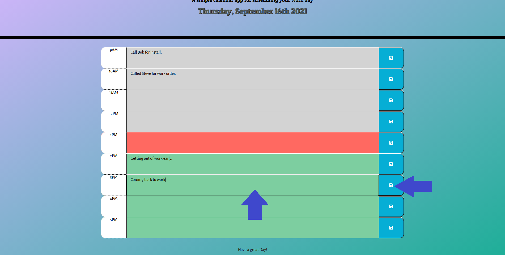

# Work-Day-Scheduler

## Description
This application is a simple calendar that will allow you to add and save events per hour. Note, this is a work-day scheduler so you will be limited to standard business hours. It is very simple to see what time of day it is or any upcoming events since the calendar is color coded. This simple scheduler will also save to your local storage and not require you to login to any email provider. It is very simple to use and only requires you to click save.

## Instructions

You can find the deployed application here&mdash;https://israelmrios.github.io/Work-Day-Scheduler/

## Demo


### Step 1
```
When landing on the page notate the current day is displayed on the top of the page. You will also see the current hour block highlighted in red, any upcoming hours in green, and past hours in gray. Any previous data saved to these timeblocks will auto load.
```


### Step 2
```
Click inside any timeblock to add an event(s). Don't forget to click the 'Save' icon! 
Thats it, your event is now saved to the local storage!
```


## Resources Used
* [GitHub](http://github.com)
* [MDN Web Docs](https://developer.mozilla.org)
* [W3 Schools](https://www.w3schools.com/)
* [JavaScript Cheat Sheet](https://websitesetup.org/javascript-cheat-sheet/)
* [Request-Response](https://coding-boot-camp.github.io/full-stack/github/professional-readme-guide)

## License
MIT License
Copyright (c) [2021] [Israel M. Rios]